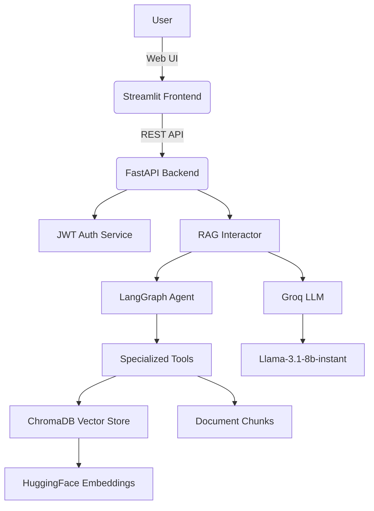
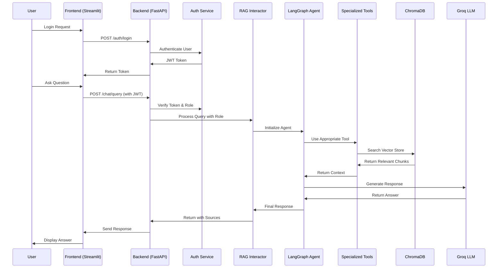
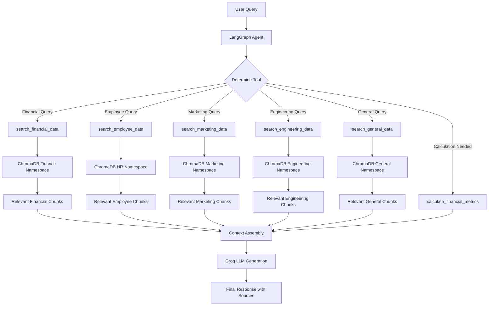

# FinGuard AI Assistant


[](https://www.python.org/)
[](https://fastapi.tiangolo.com/)
[](https://streamlit.io/)
[](https://langchain.com/)
[](https://www.trychroma.com/)
[](https://opensource.org/licenses/MIT)

---

## 🚀 Project Overview
FinGuard is an enterprise-grade AI-powered assistant designed specifically for Pakistani companies, providing secure, role-based access to organizational knowledge and data. Built with a modern tech stack including FastAPI backend, Streamlit frontend, and an advanced Retrieval-Augmented Generation (RAG) system powered by ChromaDB vector storage and LangGraph agentic AI workflows. The system features departmental data segregation, intelligent document processing, and context-aware responses using Groq's Llama-3.1-8b-instant model.

---

## 📦 Features
- **🔐 Role-based Authentication** - 6 predefined roles (Finance, HR, Marketing, Engineering, C-Level, Employee)
- **🤖 LangGraph Agentic AI** - Intelligent agent with specialized tools for different data types
- **📊 Advanced RAG System** - Context-aware document retrieval with ChromaDB vector storage
- **🎨 Modern Streamlit UI** - Elegant interface with role-specific dashboards and real-time chat
- **⚡ FastAPI Backend** - High-performance REST API with automatic documentation
- **🗂️ Intelligent Document Processing** - Advanced chunking for markdown and CSV files
- **🔒 Enterprise Security** - JWT authentication, CORS configuration, role-based data access
- **🏢 Pakistani Enterprise Context** - Tailored for local business requirements and data formats
- **📈 Real-time Health Monitoring** - Comprehensive health checks and system status
- **🚀 Demo-Ready Setup** - Pre-configured credentials and sample data for immediate testing
- **🔧 Extensible Architecture** - Easy addition of new departments, tools, and data sources
- **🌐 RESTful API** - Complete OpenAPI/Swagger documentation at `/docs`

---

## 🗂️ Directory Structure
```
FinGuard/
├── .env                           # Environment variables (API keys, config)
├── .git/                          # Git repository files
├── README.md                      # Project documentation
├── main.py                        # FastAPI application entry point
├── requirements.txt               # Python dependencies
├── backend/                       # Backend application logic
│   ├── __init__.py
│   ├── interactors/               # Business logic layer
│   │   ├── __init__.py
│   │   ├── auth.py                # Authentication business logic
│   │   └── rag.py                 # RAG system business logic
│   ├── routes/                    # API endpoints
│   │   ├── __init__.py
│   │   ├── auth.py                # Authentication endpoints
│   │   └── chat.py                # Chat/query endpoints
│   ├── schemas/                   # Data models and schemas
│   │   ├── __init__.py
│   │   └── models.py              # Pydantic models
│   ├── services/                  # Core services
│   │   ├── __init__.py
│   │   ├── chroma.py              # ChromaDB vector database service
│   │   ├── chunking.py            # Document chunking service
│   │   ├── data_loader.py         # Data loading and processing
│   │   ├── embedding.py           # Text embedding service
│   │   ├── graph.py               # LangGraph agent workflow
│   │   ├── prompts.py             # LLM prompts and templates
│   │   └── tools.py               # LangGraph tools for data retrieval
│   └── utils/                     # Utility functions
│       ├── __init__.py
│       └── auth.py                # Authentication utilities
├── data/                          # Departmental data files (Pakistani context)
│   ├── engineering/
│   │   └── engineering.md         # Engineering department data
│   ├── finance/
│   │   ├── quaterly.md           # Quarterly financial reports
│   │   └── summary.md            # Financial summaries
│   ├── general/
│   │   └── handbook.md           # Company handbook
│   ├── hr/
│   │   └── data.csv              # HR employee data
│   └── marketing/
│       ├── q1.md                 # Q1 marketing data
│       ├── q2.md                 # Q2 marketing data
│       ├── q3.md                 # Q3 marketing data
│       ├── q4.md                 # Q4 marketing data
│       └── report.md             # Marketing reports
└── frontend/                      # Streamlit frontend
    └── app.py                     # Streamlit UI application

```

---

## 🌐 Getting Started

### 1. Clone the Repository
```bash
git clone https://github.com/iqbal-waqar/FinGuard.git
cd FinGuard
```

### 2. Install Dependencies
```bash
pip install -r requirements.txt
```

### 3. Start the Backend (FastAPI)
```bash
uvicorn main:app --reload
```

### 4. Start the Frontend (Streamlit)
```bash
streamlit run frontend/app.py
```

---

## 💡 Usage Guide

### Quick Start
1. **Access the Streamlit UI** at [http://localhost:8501](http://localhost:8501)
2. **View Demo Credentials** displayed on the login page or via `/auth/demo-credentials`
3. **Login with your role** and start asking questions about company data
4. **Explore the API** at [http://localhost:8000/docs](http://localhost:8000/docs)

### Demo Credentials
| Role | Username | Password | Access |
|------|----------|----------|---------|
| Finance Team | `john_finance` | `finance123` | Financial reports, revenue, expenses |
| HR Team | `mike_hr` | `hr123` | Employee data, department statistics |
| Marketing Team | `sarah_marketing` | `marketing123` | Campaign data, marketing metrics |
| Engineering Team | `alex_engineering` | `engineering123` | Technical documentation, system specs |
| C-Level Executive | `ceo` | `ceo123` | All departmental data access |
| General Employee | `employee` | `employee123` | General company policies only |

### Example API Usage
#### Authentication
```http
POST /auth/login
{
  "username": "john_finance",
  "password": "finance123"
}
```
#### Chat Query
```http
POST /chat/query
{
  "query": "What is our total revenue for Q1 2024?",
  "namespace": "finance"
}
```

### Sample Questions by Role
- **Finance**: "What is our total revenue for Q1 2024?", "What are our main expenses?"
- **HR**: "How many employees do we have in engineering?", "What is the average salary?"
- **Marketing**: "What are our current marketing campaigns?", "Show campaign performance"
- **Engineering**: "What are the system architecture requirements?", "Show technical specifications"
- **C-Level**: "Give me an overview of company performance across all departments"
- **Employee**: "What is the company's remote work policy?", "Show general company policies"

---

## 🏗️ Architecture Diagram


---

## 🔄 Workflow Diagram


---

## 🧠 LangGraph Agentic RAG Workflow
The system uses LangGraph to create an intelligent agent that can use specialized tools for different data types, providing more accurate and contextual responses.



---

## 🔒 Security
- All API endpoints require authentication (JWT tokens)
- CORS enabled for frontend-backend communication
- Sensitive data is never exposed in logs or responses
- Role-based access control for data segregation

---

## 🧑‍💻 Advanced Features

### Extensibility
- **New Departments**: Add by placing files in `data/department_name/` folder
- **Custom Tools**: Extend LangGraph agent with specialized tools for new data types
- **Multiple LLM Support**: Easy integration with OpenAI, Anthropic, or other providers
- **Vector Database Options**: Support for Pinecone, Weaviate, or other vector stores
- **Custom Embeddings**: Use different embedding models for specific use cases

### Enterprise Features
- **Role-Based Data Access**: Granular permissions per department and user role
- **Audit Logging**: Track all user queries and system responses
- **Scalable Architecture**: Horizontal scaling support for large organizations
- **Multi-tenant Support**: Isolate data between different companies
- **API Rate Limiting**: Prevent abuse and ensure fair usage

### AI Capabilities
- **Agentic Workflows**: LangGraph enables complex multi-step reasoning
- **Tool Selection**: Intelligent choice of appropriate tools based on query context
- **Context Preservation**: Maintain conversation history and context across queries
- **Source Attribution**: Always provide document sources for transparency
- **Confidence Scoring**: Assess and communicate response reliability

---

## ❓ FAQ

**Q: Can I use this for a non-Pakistani company?**

A: Absolutely! Just replace the sample data in the `data/` folders with your company's documents and update any Pakistan-specific references in the prompts.

**Q: How do I add a new department?**

A: 1) Create a new folder under `data/department_name/`, 2) Add your documents (markdown/CSV), 3) Create a new tool in `backend/services/tools.py`, 4) Update the role permissions in `backend/utils/auth.py`.

**Q: What LLM models are supported?**

A: Currently uses Groq's Llama-3.1-8b-instant, but the architecture supports any LangChain-compatible LLM (OpenAI, Anthropic, local models, etc.).

**Q: How does role-based access work?**

A: Each user role has access to specific namespaces in ChromaDB. The system filters documents and tools based on the authenticated user's role before processing queries.

**Q: Is this production-ready?**

A: The core architecture is enterprise-grade, but you should review security settings, add proper logging, implement rate limiting, and configure environment variables for production deployment.

**Q: Can I use different embedding models?**

A: Yes! Update the embedding model in `backend/services/chroma.py`. The system uses HuggingFace embeddings by default but supports any compatible model.

**Q: How do I scale for large datasets?**

A: ChromaDB supports horizontal scaling, and you can implement database sharding by department. Consider using cloud vector databases like Pinecone for very large datasets.

---

## ⚙️ Technology Stack

### Backend
- **Python 3.10+** - Core programming language
- **FastAPI** - High-performance web framework for APIs
- **LangGraph** - Agentic AI workflow orchestration
- **ChromaDB** - Vector database for document embeddings
- **HuggingFace Transformers** - Embedding models
- **Groq** - LLM inference (Llama-3.1-8b-instant)
- **JWT** - Secure authentication tokens
- **Pydantic** - Data validation and serialization

### Frontend
- **Streamlit** - Interactive web application framework
- **Custom CSS** - Modern UI styling with gradients and animations

### Data Processing
- **Pandas** - CSV data manipulation
- **Markdown** - Document processing
- **Text Chunking** - Intelligent document segmentation

### Infrastructure
- **CORS** - Cross-origin resource sharing
- **Environment Variables** - Configuration management
- **Health Checks** - System monitoring

---

## 🤝 Contributing
Contributions are welcome! Please fork the repo and submit a pull request. For major changes, open an issue first to discuss what you would like to change.

---

## 🐞 Issues
If you encounter any problems, please open an [issue](https://github.com/iqbal-waqar/FinGuard/issues).

---

## 🙏 Acknowledgments
- [FastAPI](https://fastapi.tiangolo.com/)
- [Streamlit](https://streamlit.io/)
- [ChromaDB](https://www.trychroma.com/)
- [Mermaid](https://mermaid-js.github.io/)
- All contributors and users!

---

## 📄 License
MIT

---

## 📬 Contact
For questions or support, contact at waqar302iqbal@gmail.com
